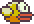

# Flappy Evolution  
  
Flappy Evolutions is a Javascript Game that uses Machine Learning
to display the evolutionary theory. This is also called an 
evolutionary simulator. 
 

 
## How it works
 
We start off by creating x amount of birds. Every time our program 
runs we calculate a fitness score and take the half of the birds.
Then we kill off the bottom half and breed the top birds together
and throw in a few mutation. After a few generations we should get
a bird to successfully complete the course. 